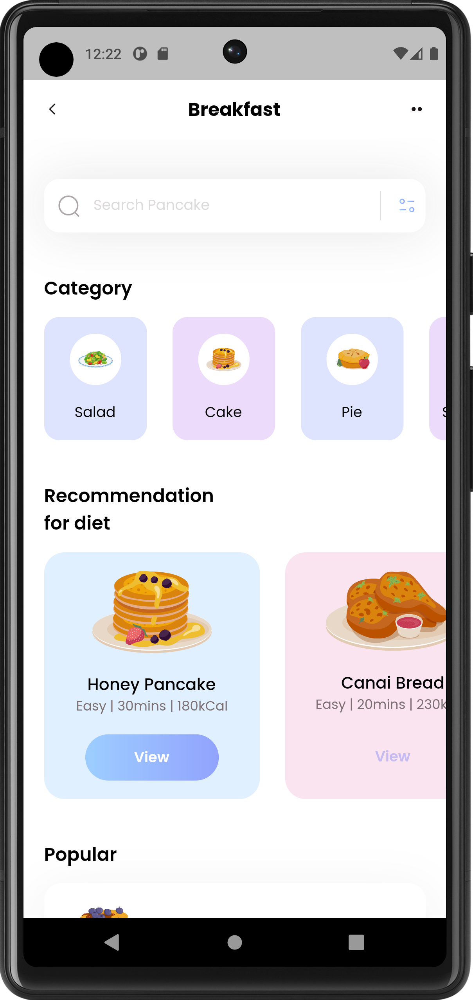

# single_screen

A new Flutter project.

## Getting Started

[Watch Demo Video](https://greenedubd-my.sharepoint.com/:i:/g/personal/nahid_201902073_green_ac_bd/Ebhy8eBMrUdNn_f2ayQRdqcBaJavHW1Io5wkMKpKi2gTGA?e=dQTQL7)
This project is a starting point for a Flutter application.

A few resources to get you started if this is your first Flutter project:

- [Lab: Write your first Flutter app](https://docs.flutter.dev/get-started/codelab)
- [Cookbook: Useful Flutter samples](https://docs.flutter.dev/cookbook)
- [This single Screen UI design video available in YouTube](https://youtu.be/D4nhaszNW4o?si=NYlZ2f6ETv5wu-3O)
For help getting started with Flutter development, view the
[online documentation](https://docs.flutter.dev/), which offers tutorials,
samples, guidance on mobile development, and a full API reference.
